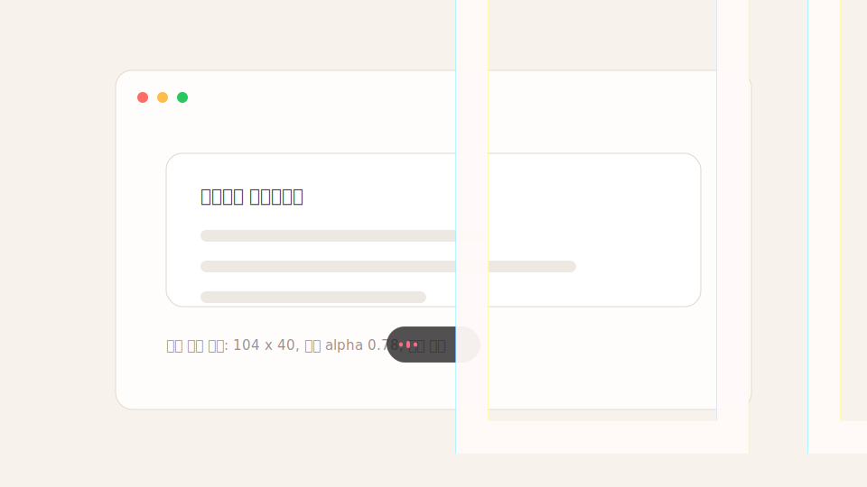

# Qwen Dictation

> Local-first Mac dictation powered by Qwen3-ASR. Hold Right Cmd, speak, and it
> types into any app.

Qwen Dictation runs from the macOS menu bar, records only while you trigger it,
and types into the currently focused input field. Qwen3-ASR is the default local
engine.

Why it is useful:

- **Works anywhere you can type**: Cursor, ChatGPT, Slack, mail, browsers, and editors.
- **Local by default**: audio is processed on your Mac, not sent to a cloud API.
- **Fast push-to-talk flow**: hold Right Cmd to dictate, or toggle with Right Option.
- **Vocabulary-aware**: register names and specialist terms for better recognition.

<p align="center">
  
</p>

## Status

This is a developer MVP. The core dictation loop works, but the install flow is
still terminal-based and a polished signed macOS app is not ready yet.

## How it works

1. Focus any text field.
2. Hold Right Cmd and speak.
3. Qwen Dictation transcribes locally and types into the focused app.
4. Release Right Cmd to stop.

Right Option can be used as a toggle instead of a hold key.

## 받아쓰기 방식 (실시간 스트리밍)

실시간 스트리밍 단축키 2개 — 오른쪽 Cmd 홀드(누르는 동안) / 오른쪽 Option 토글(눌러 시작, 다시 눌러 정지). 말하는 대로 포커스된 입력창에 ~0.8초 간격으로 바로 타이핑되고, 문맥이 바뀌면 앞부분을 고쳐 쓰며, 쉬는 지점에서 확정한다. 리뷰 패널·배치·자동전송은 제거됨.

## Install

One-line install for a new Mac:

```bash
curl -fsSL https://raw.githubusercontent.com/jhoshim89/qwen-dictation/912491d75039847a95c6d673e1fd77c8d4bd4a87/install.sh | bash
```

This installs PortAudio with Homebrew, clones the app into
`~/.qwen-dictation/source`, creates a Python virtual environment, downloads
`Qwen/Qwen3-ASR-1.7B` into the Hugging Face cache, and launches the menu-bar app.

Manual development install:

```bash
brew install portaudio
python3 -m venv venv
source venv/bin/activate
pip install -r requirements.txt
HF_HUB_DISABLE_XET=1 HF_HUB_ENABLE_HF_TRANSFER=1 huggingface-cli download Qwen/Qwen3-ASR-1.7B
```

## Run

```bash
./run.sh
```

Dashboard:

```text
http://127.0.0.1:5001
```

기본 단축키는 두 개입니다.

- **오른쪽 Cmd 홀드**: 키를 누르고 있는 동안 받아쓰기, 떼면 정지.
- **오른쪽 Option 토글**: 한 번 눌러 시작, 다시 눌러 정지.

둘 다 똑같은 실시간 스트리밍으로 동작합니다. 말하는 대로 ~0.8초마다 포커스된
입력창에 바로 타이핑되고, 문맥이 바뀌면 앞부분을 backspace로 고쳐 쓰며, 잠깐
쉬는 지점에서 그 구간을 확정합니다.

## macOS Permissions

The app needs Microphone and Accessibility permissions because it listens to a
global hotkey, records audio, and types into the focused app.

1. Open **System Settings > Privacy & Security > Microphone**.
2. Enable the terminal app you use to run this project, such as Terminal, iTerm, or Codex.
3. Open **System Settings > Privacy & Security > Accessibility**.
4. Enable the same terminal app.
If typing does nothing, Accessibility is usually missing. If recording fails,
Microphone permission is usually missing.

## Word registration (vocabulary)

Register names and specialist terms in the dashboard. They are passed to Qwen as
recognition context on the next dictation. The list lives at
`~/.qwen-dictation/vocabulary.json`, one word or short phrase per entry.

Note: this biases recognition toward those words — it improves accuracy but is not a
guaranteed substitution. Legacy `dictionary.json` files are left untouched but
are no longer read or applied.

Example `vocabulary.json`:

```json
["Qwen", "각막", "궤양", "염색"]
```

## Recent dictation and vocabulary suggestions

The dashboard stores the latest 50 final transcript texts locally, without
audio. Correct a recent transcript inside the dashboard to create vocabulary
candidates. A candidate is only added to the Qwen context after explicit
approval. Repeated edits are recommended after two separate transcript records;
nothing is learned from typing performed in other apps.

## Hotkeys (configurable in the dashboard)

Choose a hold key and a toggle key from the right-side modifiers. They must
differ, and changes apply immediately without restart.

## Settings persistence

Settings (language, microphone, max recording time, and hotkeys) are saved to
`~/.qwen-dictation/config.json` and restored on next launch. Recording stops
after 300 seconds by default; set `max_time = 0` in advanced settings for no
limit.
The only model is **Qwen3-ASR 1.7B** (loads once on first dictation, then ~0.5s
per utterance).

## Known limitations

- macOS only.
- Current install flow is developer-oriented and terminal-based.
- Accuracy depends on microphone quality, noise, language, and vocabulary.
- This is not intended for regulated medical, legal, or compliance transcription.
- A signed `.app`, auto-updater, and model manager are future packaging work.

## Roadmap

- Add a short README demo GIF/video when available.
- Package a signed and notarized macOS app.
- Add a model manager for downloading, switching, and removing local ASR models.
- Improve install diagnostics and permission onboarding.
- Collect real microphone benchmarks across languages and Mac hardware.

## Contributing

Bug reports, install feedback, real microphone accuracy notes, and focused pull
requests are welcome. See [CONTRIBUTING.md](CONTRIBUTING.md) for the current
priorities and bug report details.

## Brand system

The app's Warm Jelly Voice identity is documented in `DESIGN.md`. The selected
raspberry-jelly app icon source lives at `assets/AppIcon-source.png`; the flat
settings/menu-bar silhouette lives at `assets/logo-mark.svg`. Pretendard is
bundled locally under `assets/fonts/`. Run `./venv/bin/python make_icon.py`
after changing the icon source or menu-bar silhouette to rebuild
`assets/AppIcon.icns` and `assets/menubar.png`.

## Development Checks

```bash
./venv/bin/python -m py_compile whisper-dictation.py dashboard.py dictation_history.py hud_overlay.py
./venv/bin/pytest -q
./venv/bin/python - <<'PY'
import flask, numpy, pyaudio, pynput, qwen_asr, rumps, soundfile, torch
print("imports ok", torch.backends.mps.is_available())
PY
```

Pre-download the default model without launching the app:

```bash
HF_HUB_DISABLE_XET=1 HF_HUB_ENABLE_HF_TRANSFER=1 ./venv/bin/huggingface-cli download Qwen/Qwen3-ASR-1.7B
```

Equivalent Python helper:

```bash
./venv/bin/python download_qwen_model.py
```
