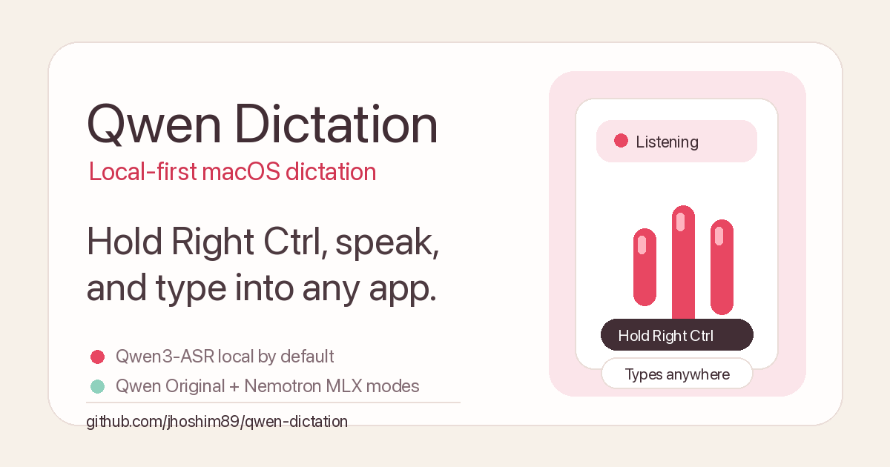

# Qwen Dictation

> Local-first Mac dictation powered by Qwen3-ASR. Hold Right Ctrl, speak, and it
> types into any app.

[Website](https://jhoshim89.github.io/qwen-dictation/) ·
[Repository](https://github.com/jhoshim89/qwen-dictation)

Qwen Dictation runs from the macOS menu bar, records only while you trigger it,
and types into the currently focused input field. Qwen3-ASR is the default local
engine, with Qwen Original and Nemotron 3.5 ASR via MLX available from the
dashboard.

Why it is useful:

- **Works anywhere you can type**: Cursor, ChatGPT, Slack, mail, browsers, and editors.
- **Local by default**: audio is processed on your Mac, not sent to a cloud API.
- **Fast push-to-talk flow**: hold Right Ctrl to dictate, or toggle with Right Option.
- **Vocabulary-aware**: register names and specialist terms for better recognition.

<p align="center">
  
</p>

## Status

This is a developer MVP. The core dictation loop works, but the install flow is
still terminal-based and a polished signed macOS app is not ready yet.

If this saves you typing or gives you a useful local-ASR reference, a GitHub star
helps other Mac users find it.

## How it works

1. Focus any text field.
2. Hold Right Ctrl and speak.
3. Qwen Dictation transcribes locally and types into the focused app.
4. Release Right Ctrl to stop.

Right Option can be used as a toggle instead of a hold key.

## 받아쓰기 방식 (실시간 스트리밍)

실시간 스트리밍 단축키 2개 — 오른쪽 Ctrl 홀드(누르는 동안) / 오른쪽 Option 토글(눌러 시작, 다시 눌러 정지). 말하는 대로 포커스된 입력창에 ~0.8초 간격으로 바로 타이핑되고, 문맥이 바뀌면 앞부분을 고쳐 쓰며, 쉬는 지점에서 확정한다. 리뷰 패널·배치·자동전송은 제거됨.

## Install

One-line install for a new Mac:

```bash
curl -fsSL https://raw.githubusercontent.com/jhoshim89/qwen-dictation/main/install.sh | bash
```

This installs PortAudio with Homebrew, clones the app into
`~/.qwen-dictation/source`, creates a Python virtual environment, downloads
`Qwen/Qwen3-ASR-1.7B` into the Hugging Face cache, and launches the menu-bar app.

Manual development install:

```bash
brew install portaudio
python3 -m venv venv
source venv/bin/activate
pip install -r requirements.txt
HF_HUB_DISABLE_XET=1 HF_HUB_ENABLE_HF_TRANSFER=1 huggingface-cli download Qwen/Qwen3-ASR-1.7B
```

## Run

```bash
./run.sh
```

Dashboard:

```text
http://127.0.0.1:5001
```

기본 단축키는 두 개입니다.

- **오른쪽 Ctrl 홀드**: 키를 누르고 있는 동안 받아쓰기, 떼면 정지.
- **오른쪽 Option 토글**: 한 번 눌러 시작, 다시 눌러 정지.

둘 다 똑같은 실시간 스트리밍으로 동작합니다. 말하는 대로 ~0.8초마다 포커스된
입력창에 바로 타이핑되고, 문맥이 바뀌면 앞부분을 backspace로 고쳐 쓰며, 잠깐
쉬는 지점에서 그 구간을 확정합니다.

## macOS Permissions

The app needs Microphone and Accessibility permissions because it listens to a
global hotkey, records audio, and types into the focused app.

1. Open **System Settings > Privacy & Security > Microphone**.
2. Enable the terminal app you use to run this project, such as Terminal, iTerm, or Codex.
3. Open **System Settings > Privacy & Security > Accessibility**.
4. Enable the same terminal app.
If typing does nothing, Accessibility is usually missing. If recording fails,
Microphone permission is usually missing.

## Word registration (vocabulary)

Register names and specialist terms in the dashboard. They are passed to Qwen as
recognition context on the next dictation, and are applied as post-correction
terms for engines that do not expose the same context API. The list lives at
`~/.qwen-dictation/vocabulary.json`, one word or short phrase per entry.

Note: this biases recognition toward those words — it improves accuracy but is not a
guaranteed substitution. Legacy `dictionary.json` files are left untouched but
are no longer read or applied.

Example `vocabulary.json`:

```json
["Qwen", "각막", "궤양", "염색"]
```

## Recent dictation and vocabulary suggestions

The dashboard stores the latest 50 final transcript texts locally, without
audio. Correct a recent transcript inside the dashboard to create vocabulary
candidates. A candidate is only added to the Qwen context after explicit
approval. Repeated edits are recommended after two separate transcript records;
nothing is learned from typing performed in other apps.

## Hotkeys (configurable in the dashboard)

Choose a hold key and a toggle key from the right-side modifiers. They must
differ, and changes apply immediately without restart.

## Settings persistence

Settings (language, microphone, max recording time, and hotkeys) are saved to
`~/.qwen-dictation/config.json` and restored on next launch. Recording stops
after 300 seconds by default; set `max_time = 0` in advanced settings for no
limit.
The default engine is **Qwen3-ASR 1.7B**. Dashboard engines:

- **Qwen3-ASR 1.7B Original**: rolling WAV transcription for direct Qwen output.
- **Nemotron 3.5 ASR 0.6B (MLX)**:
  `mlx-community/nemotron-3.5-asr-streaming-0.6b`

Install the optional Nemotron runtime without letting it replace Qwen's pinned
`transformers==4.57.6`:

```bash
./install_nemotron_mlx.sh
```

Avoid plain `pip install mlx-audio` in this environment; its current dependency
metadata asks pip to upgrade Transformers to a version that breaks `qwen-asr`.

## ASR comparison

Create a small local bench folder with matching audio and reference files:

```text
bench_audio/
  001.wav
  001.txt
  002.wav
  002.txt
```

Run the default local comparison engines on the same files:

```bash
./venv/bin/python compare_asr.py bench_audio --language ko --output asr_compare.csv
```

Compare all dashboard engines after installing Nemotron:

```bash
./venv/bin/python compare_asr.py bench_audio --engines qwen,qwen_original,nemotron_mlx --language ko --output asr_compare.csv
```

Use `--context app` to include the current vocabulary/domain context where an
engine supports it. The CSV contains raw text, CER/WER when `.txt` references
exist, and per-file latency. The current smoke-test judgment is kept in
`docs/asr-comparison.md`.

## Known limitations

- macOS only.
- Current install flow is developer-oriented and terminal-based.
- Accuracy depends on microphone quality, noise, language, and vocabulary.
- This is not intended for regulated medical, legal, or compliance transcription.
- A signed `.app`, auto-updater, and model manager are future packaging work.

## Release readiness checklist

Current release target: **developer MVP readiness**, not a signed or notarized consumer app.

- **Install:** Homebrew PortAudio, Python virtual environment, `requirements.txt`, Qwen model download, and `./run.sh` are the supported path.
- **Permissions:** users must grant Microphone and Accessibility to the terminal/app host that runs Qwen Dictation.
- **Runtime smoke:** verify Right Ctrl hold, Right Option toggle, focused-app typing, streaming cadence, vocabulary context, and recent dictation privacy.
- **Dashboard:** verify settings persistence, microphone selection, ASR engine selection, vocabulary, history correction, and candidate approval.
- **HUD/design:** keep the current text-bearing HUD pill as an intentional `DESIGN.md` exception; verify pill and pinned modes for clipping, contrast, screen-edge overlap, and microphone-level readability.
- **Packaging:** `./build_app.sh` writes `dist.noindex/Qwen Dictation.app`; signing/notarization, auto-updater, and model manager remain future work unless separately implemented.
- **Evidence:** record focused pytest, full pytest when appropriate, `py_compile`, CLI smoke, optional LazyCodex/OmO health note, visual QA notes, and manual macOS permission limits.

### Release readiness diagnosis matrix

| Item | Evidence | User impact | Decision | Verification |
|------|----------|-------------|----------|--------------|
| HUD source of truth | `hud_overlay.py`, dashboard HUD previews, and tests use a text-bearing status pill while earlier `DESIGN.md` text said native HUD had no text. | Removing status text would make listening/processing state less obvious. | Keep the text-bearing pill as an intentional `DESIGN.md` exception and document it here. | HUD tests plus local visual QA for pill/pinned clipping, contrast, edge overlap, and mic-level readability. |
| Landing-page design drift | `docs/index.html` used a separate darker berry/mint/gold palette instead of Warm Jelly Voice tokens. | Public first impression felt less connected to the app/dashboard brand. | Align landing-page CSS variables and hero wash to `DESIGN.md` colors while keeping developer-MVP copy. | Browser/static visual QA for spacing, clipping, overlap, contrast, and responsive hero composition. |
| Packaged app output path | `build_app.sh` produces an app bundle under `dist.noindex/`. | Users and maintainers need the current artifact path when checking builds. | Document `dist.noindex/Qwen Dictation.app` and keep signed/notarized distribution as future work. | Conditional packaging verification when packaging files are edited or packaging is in scope. |
| macOS permissions | Microphone and Accessibility cannot be granted by automated tests. | Recording or typing may fail despite passing code tests. | Keep permission checks as manual release-readiness evidence. | Manual System Settings checklist separated from automated pass/fail claims. |

## Roadmap

- Add a short README demo GIF/video when available.
- Package a signed and notarized macOS app.
- Add a model manager for downloading, switching, and removing local ASR models.
- Improve install diagnostics and permission onboarding.
- Collect real microphone benchmarks across languages and Mac hardware.

## Contributing

Bug reports, install feedback, real microphone accuracy notes, and focused pull
requests are welcome. See [CONTRIBUTING.md](CONTRIBUTING.md) for the current
priorities and bug report details.

## Brand system

The app's Warm Jelly Voice identity is documented in `DESIGN.md`. The selected
raspberry-jelly app icon source lives at `assets/AppIcon-source.png`; the flat
settings/menu-bar silhouette lives at `assets/logo-mark.svg`. Pretendard is
bundled locally under `assets/fonts/`. Run `./venv/bin/python make_icon.py`
after changing the icon source or menu-bar silhouette to rebuild
`assets/AppIcon.icns` and `assets/menubar.png`.

## Development Checks

```bash
./venv/bin/python -m py_compile whisper-dictation.py dashboard.py dictation_history.py hud_overlay.py
./venv/bin/pytest -q
./venv/bin/python - <<'PY'
import flask, numpy, pyaudio, pynput, qwen_asr, rumps, soundfile, torch
print("imports ok", torch.backends.mps.is_available())
PY
```

Pre-download the default model without launching the app:

```bash
HF_HUB_DISABLE_XET=1 HF_HUB_ENABLE_HF_TRANSFER=1 ./venv/bin/huggingface-cli download Qwen/Qwen3-ASR-1.7B
```

Pre-download Nemotron MLX:

```bash
HF_HUB_DISABLE_XET=1 HF_HUB_ENABLE_HF_TRANSFER=1 ./install_nemotron_mlx.sh
```

Equivalent Python helper:

```bash
./venv/bin/python download_qwen_model.py
```
